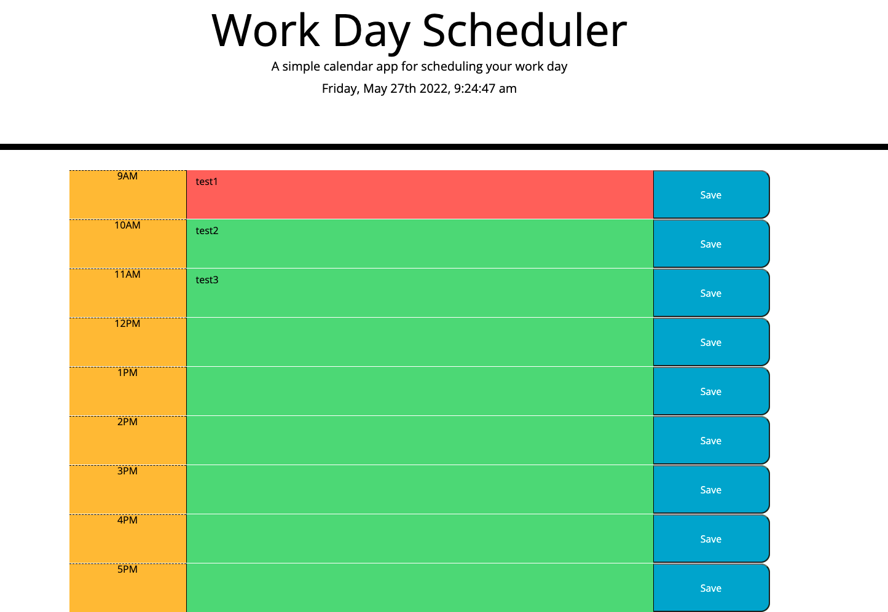

# Work-Day-Scheduler

## Task

I created a calendar application that allows users to input events for each hour of the day.

## Features

```
The current day/time is displayed at the top of the calendar (Moment.js)
Color coded timeblocks for standard business hours that indicate whether it's in the past present or future
Users can click into a timeblock and enter an event
Users can I click the save button for that timeblock and save the event in local storage
When users refresh the page the saved events persist
```

# GitHub Pages:

https://clogerie92.github.io/Work-Day-Scheduler/

## Mock-Up



## Contributer: Carl Logerie

Email: carl.logerie92@gmail.com